# Groove Lab

A groove workstation and music-genre library that runs entirely in the browser. 159 genres, each
with a short production note and an eight-track pattern you can play, edit and export.

**Live demo: <https://groove.wangda.today/>** · [中文说明](README.zh-CN.md)

<p align="center">
  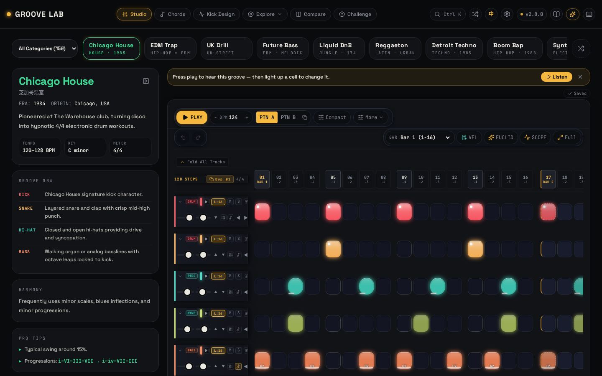
</p>

<p align="center">
  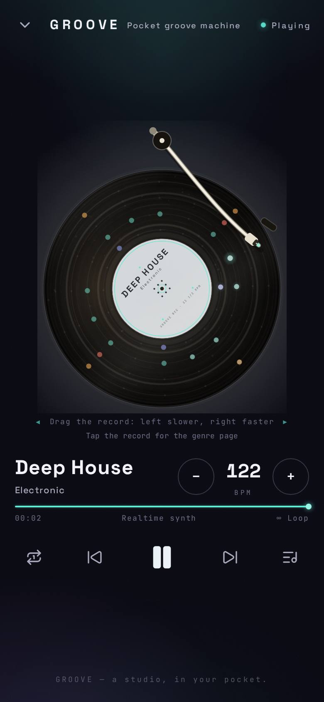
  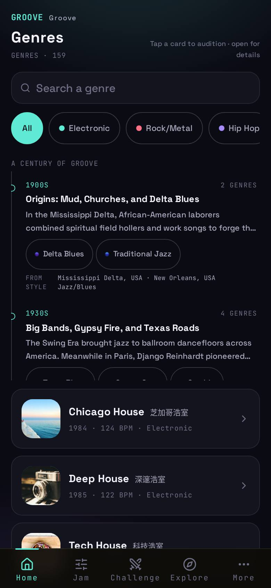
  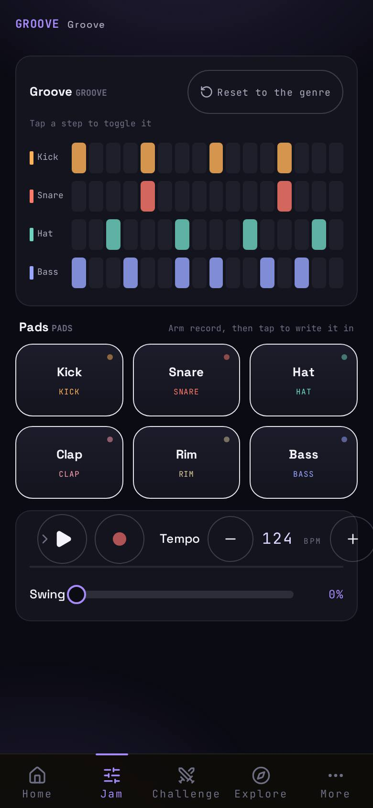
  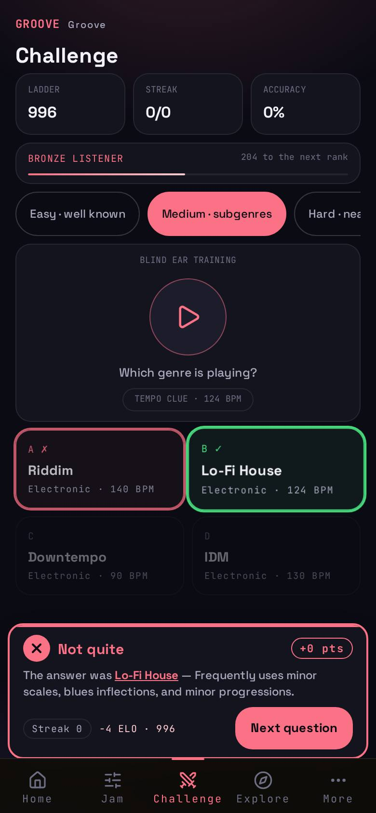
</p>

## Two surfaces, six skins

The desktop is a full workstation; the phone is a separate, thumb-first app at `/m/…` with its own
navigation, its own player and its own 16-step 即兴 editor. Six skins re-dress **both** — the same palette
on either surface, because the desktop's tokens are generated from the phone's own (`scripts/desktop_skins.mjs`).
Switch them in the desktop's **Settings → Interface → Appearance**, or on the phone in **更多 → 外观**; the
choice is shared, so the two never disagree about which skin is active:

| | | |
|---|---|---|
| 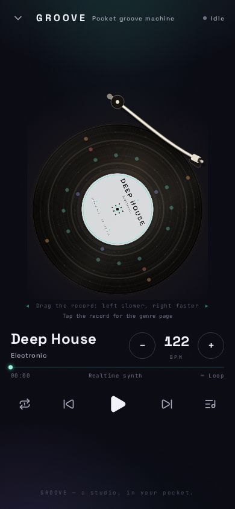<br>**Aurora**<br>cool dark, one accent per module | 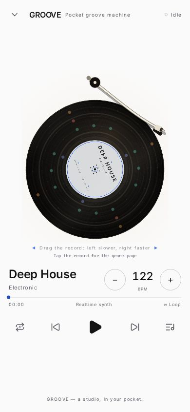<br>**Modern minimal**<br>paper-white, Inter, hairlines | 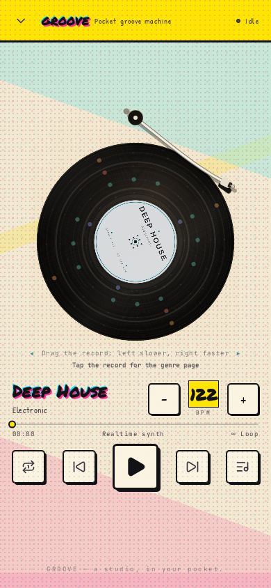<br>**Retro comic**<br>newsprint, Ben-Day dots, misregistration |
| 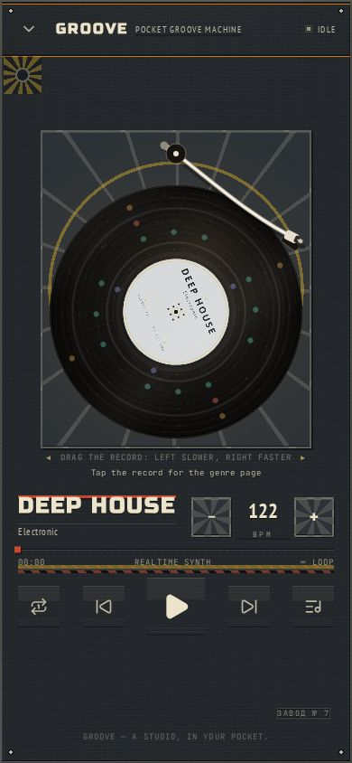<br>**Heavy industry**<br>stamped steel, rivets, signal lamps | 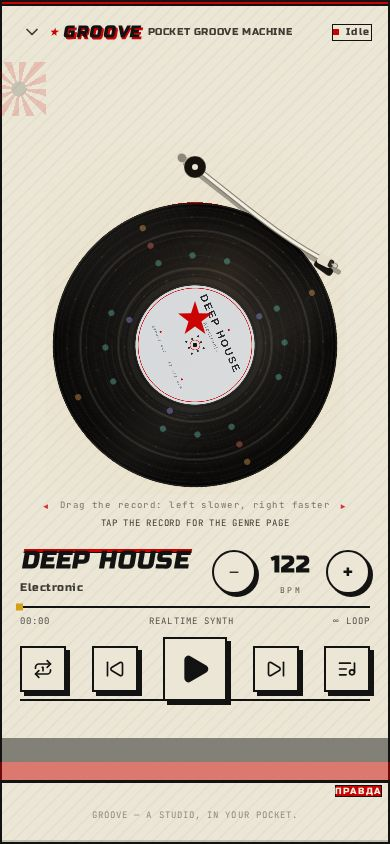<br>**Soviet years**<br>constructivist poster, flag red, hard shadows | 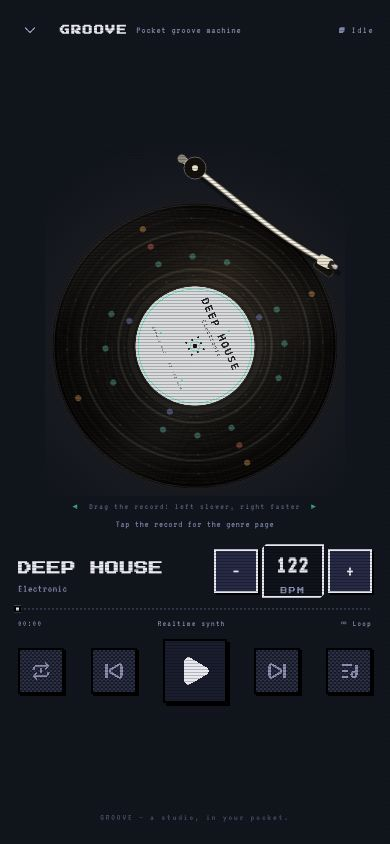<br>**8-bit pixel**<br>scanlines, stepped frames, pixel type |

## More of it

| | |
|---|---|
| 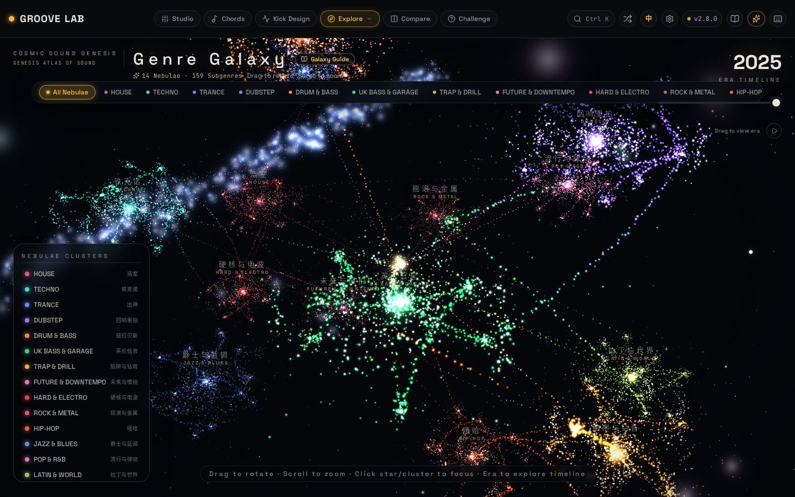<br>**Genre galaxy** — the library as a 3D map | 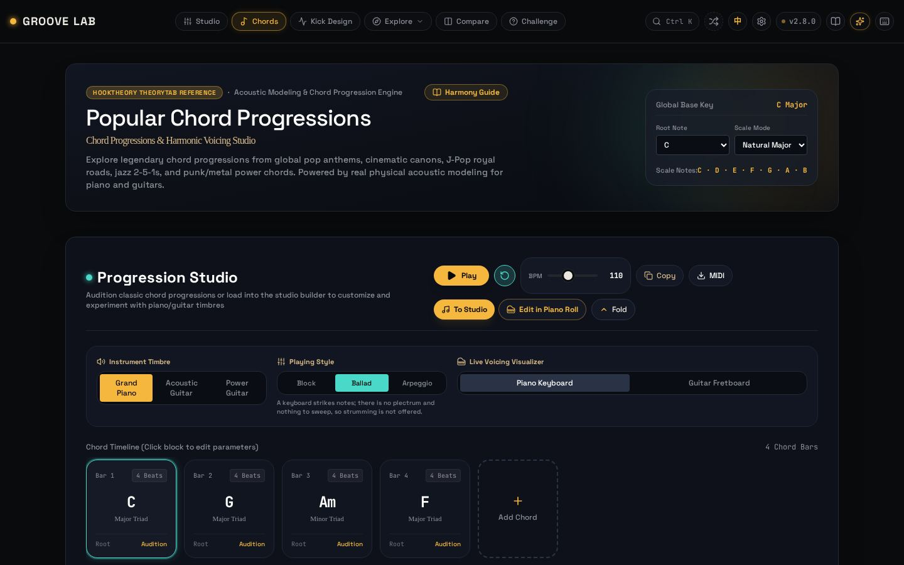<br>**Chord workshop** — progressions, voicings, auditions |
| 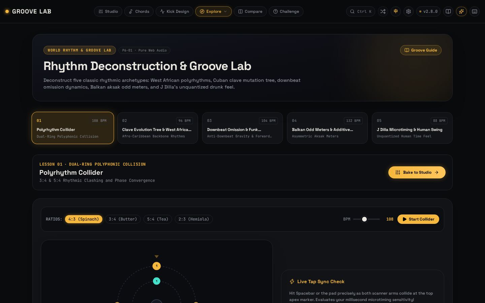<br>**Masterclass** — rhythm deconstruction with a live collider | 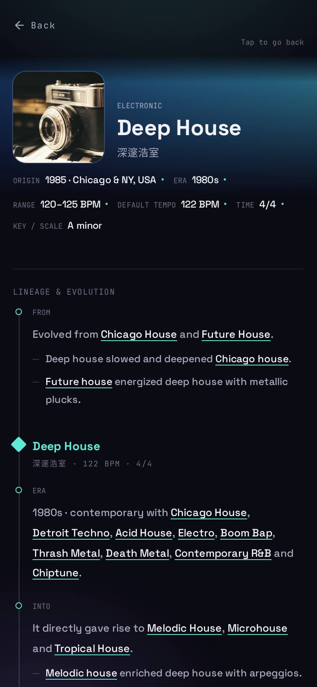<br>**Genre page (phone)** — lineage and evolution as a diagram |

## What is in it

- **159 genres** — house, techno, hip-hop, trap, bebop, cumbia, afrobeat and many more — each with a
  bilingual production note (instruments, structure, rhythm, chord movement, key artists) and a
  playable pattern.
- **Sequencer** — eight tracks, 16 to 128 steps (one to eight bars), with velocity, ratchets,
  probability, parameter locks, swing, song mode and A/B pattern slots.
- **Piano roll** — per-track note editing, chord progressions, quantise, legato, velocity shaping,
  and an isolated preview of a single lane.
- **Synthesised sound, no samples.** Drums, basses, pads and leads are built from Web Audio
  oscillators and buffers, including modelled kits (TR-808, TR-909, acoustic, cyber-wave). Nothing is
  fetched at runtime, so it also works offline.
- **Export** — WAV master, **MP3 (192 kbps)**, per-track stem ZIP, standard MIDI, and an Ableton Live `.als`
  project. The MP3 encoder is loaded only when you ask for an MP3 (a separate ~67 KB-on-the-wire chunk), so
  it costs nothing to the people who never use it; it is LGPL, and its licence ships in
  [public/THIRD_PARTY_NOTICES.md](public/THIRD_PARTY_NOTICES.md).
  A pattern can be shared as a URL too.
- **Besides the studio** — a 3D genre galaxy, an A/B compare view, and a blind ear-training
  challenge.
- **Chinese and English UI**, installable as a PWA.

## Requirements

Node.js **22.22.2 or newer** for development (see `engines` in `package.json` and `.nvmrc`). The app
itself needs only a browser: there is no backend, no database and no API key.

The version matters for one dependency: `jsdom` 30 — the DOM used by the unit tests — vendors
`undici` 8, which calls `worker_threads.markAsUncloneable`. That export does not exist in Node 20, so
on Node 20 the jsdom environment fails to construct and every test file errors before running a single
test. `npm ci` refuses to install on an unsupported Node (`.npmrc` sets `engine-strict`), which turns
that into one clear message instead of a coverage report full of zeros.

## Run it

```bash
npm install
npm run dev          # http://localhost:3000
```

```bash
npm run build        # static output in dist/
npm run preview      # serve the build locally
```

## Tests

```bash
npm test             # unit and component tests (Vitest)
npm run verify       # the gate a change has to pass
npm run test:e2e:all # full seven-target Playwright matrix
```

`npm run verify` checks version and doc consistency, layering, CSS usage, types, lint, data schemas,
tests, the production build, two measurement probes and the end-to-end matrix. The end-to-end tests
need the browsers once: `npx playwright install --with-deps chromium firefox webkit`.

## Deploy

The build is a plain static bundle, so any static host works. This repository deploys to Cloudflare
Workers with `npm run deploy`; see [DEPLOY.md](DEPLOY.md).

## Layout

| Path | What lives there |
| --- | --- |
| `src/audio/` | Web Audio engine, drum and synth models, offline renderers, exporters |
| `src/data/` | The 159 genre definitions, presets and music-theory tables |
| `src/features/` | Sequencer state, editing operations, undo history |
| `src/components/`, `src/views/` | Studio, sequencer, galaxy, compare, challenge, detail views |
| `scripts/` | Gates, measurement probes and the end-to-end matrix |

The design notes behind the code are kept in the repository, in Chinese: `PRODUCT_PLAN_v2.1.0.md`
(current plan and technical appendices), `ROADMAP_V2.md`, `BACKLOG.md` and
`ARCHITECTURE_SURFACES.md`.

## Known limitations

- Repeated exports of the same pattern are not bit-identical. The scheduler is deterministic, but
  Chrome's own DSP diverges slightly between renders, so the promise is a tolerance, not equality.
- Audio cannot start without a user gesture — browsers require a click or key press before sound.
- The phone layout is being redesigned; the desktop layout is currently the most complete.

## MCP server (for other LLMs and agents)

The genre library, the sequencer, the exporters and the measurements are exposed over the
[Model Context Protocol](https://modelcontextprotocol.io), so an agent can search the 159 genres, read a genre's
recorded facts, compose a pattern from it, export MIDI/Ableton, build a share link, and render real WAV/MP3
through the app's own engine.

```bash
npm run mcp:build        # → dist-mcp/groove-mcp.mjs
GROOVE_MCP_OUT=/tmp/groove npm run mcp
npm run check:mcp        # the gate: boots it over stdio and calls the tools
```

Point any stdio MCP client at `dist-mcp/groove-mcp.mjs`. The full contract — every tool, resource and prompt, plus
what is deliberately not exposed — is in [docs/MCP.md](docs/MCP.md), with client configuration in
[mcp/README.md](mcp/README.md).

## License

MIT — see [LICENSE](LICENSE). The bundled GS-1 synth core and the DSP libraries compiled into it are
MIT as well; the notices and full license texts are in
[public/THIRD_PARTY_NOTICES.md](public/THIRD_PARTY_NOTICES.md).
