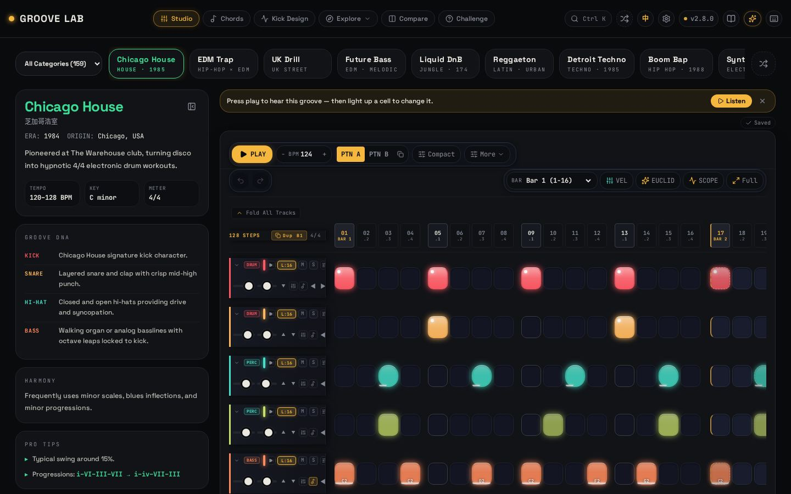
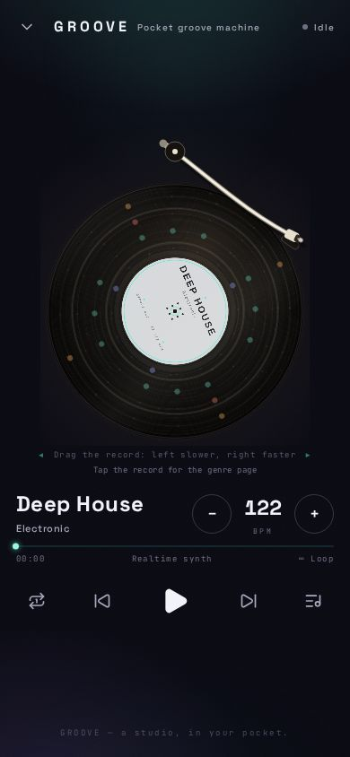
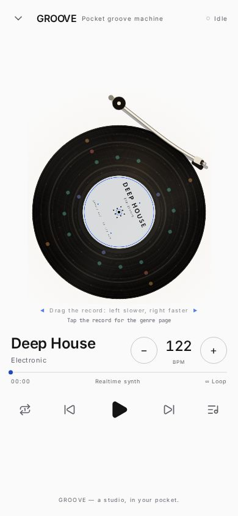
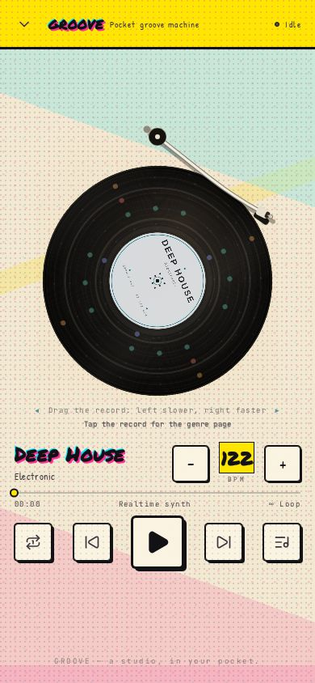
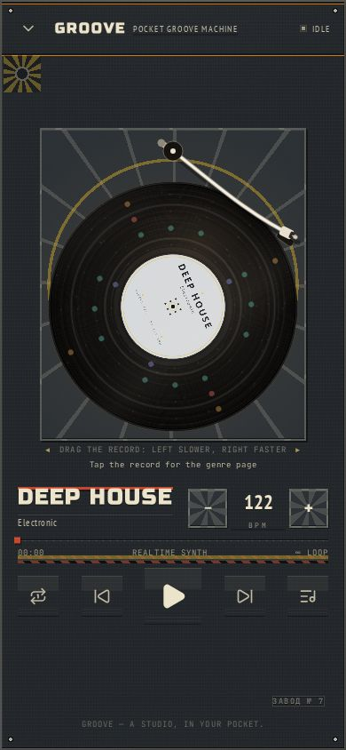
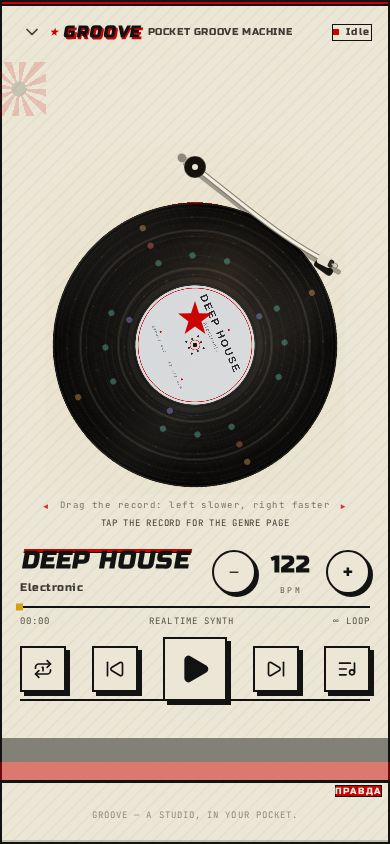
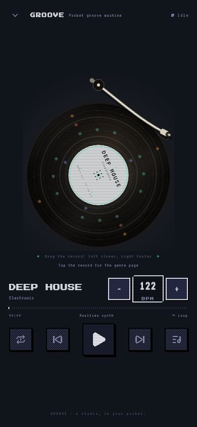
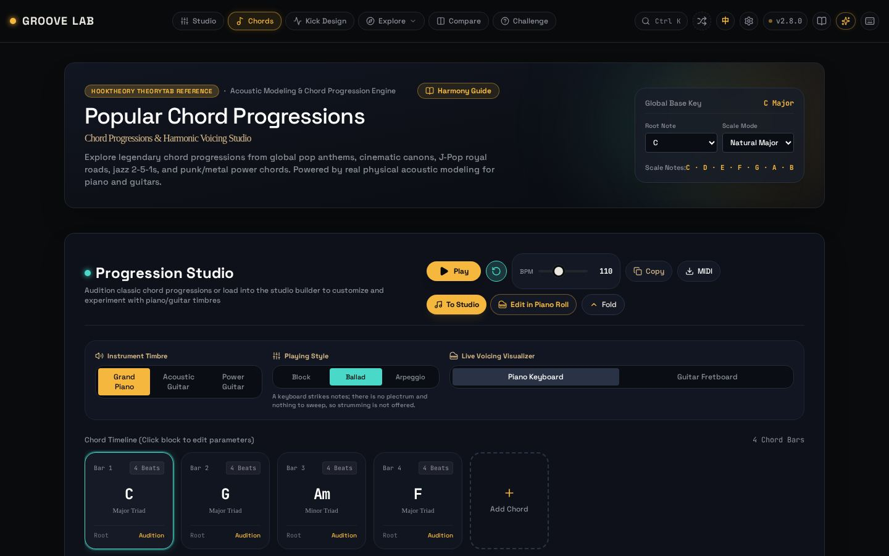
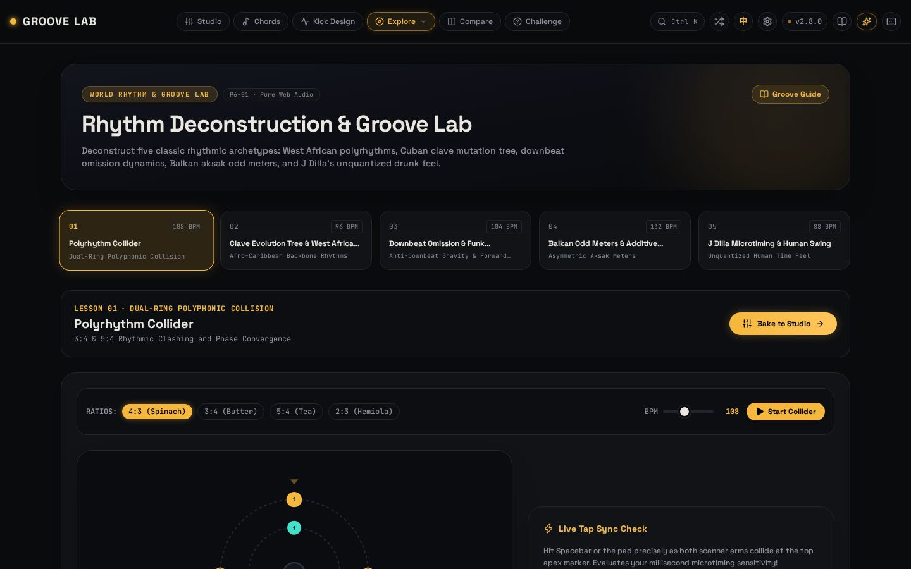

# Groove Lab

A groove workstation and music-genre library that runs entirely in the browser. 159 genres, each
with a short production note and an eight-track pattern you can play, edit and export.

**Live demo: <https://groove.wangda.today/>** · [中文说明](README.zh-CN.md)

<p align="center">
  
</p>

## Six skins

The desktop is a full workstation, and it is the only surface: the separate thumb-first phone shell was
cut, so a phone browser gets this same UI. Six skins re-dress it, and the desktop's tokens are generated
from the six palette sheets (`scripts/desktop_skins.mjs`). Switch them in **Settings → Interface →
Appearance**:

| | | |
|---|---|---|
| <br>**Aurora**<br>cool dark, one accent per module | <br>**Modern minimal**<br>paper-white, Inter, hairlines | <br>**Retro comic**<br>newsprint, Ben-Day dots, misregistration |
| <br>**Heavy industry**<br>stamped steel, rivets, signal lamps | <br>**Soviet years**<br>constructivist poster, flag red, hard shadows | <br>**8-bit pixel**<br>scanlines, stepped frames, pixel type |

## More of it

| | |
|---|---|
| <br>**Genre galaxy** — the library as a 3D map | <br>**Chord workshop** — progressions, voicings, auditions |
| <br>**Masterclass** — rhythm deconstruction with a live collider | |

## What is in it

- **159 genres** — house, techno, hip-hop, trap, bebop, cumbia, afrobeat and many more — each with a
  bilingual production note (instruments, structure, rhythm, chord movement, key artists) and a
  playable pattern.
- **Sequencer** — eight tracks, 16 to 128 steps (one to eight bars), with velocity, ratchets,
  probability, parameter locks, swing, song mode and A/B pattern slots.
- **Piano roll** — per-track note editing, chord progressions, quantise, legato, velocity shaping,
  and an isolated preview of a single lane.
- **Synthesised sound, with sampled instruments fetched on demand.** Drums, basses, pads and leads are
  built from Web Audio oscillators and buffers, including modelled kits (TR-808, TR-909, acoustic,
  cyber-wave), so those need no network. The sampled piano and orchestral libraries are downloaded per
  instrument from the project's sample mirror, so a genre that uses one does need a connection.
- **Export** — WAV master, **MP3 (192 kbps)**, per-track stem ZIP, standard MIDI, and an Ableton Live `.als`
  project. The MP3 encoder is loaded only when you ask for an MP3 (a separate ~67 KB-on-the-wire chunk), so
  it costs nothing to the people who never use it; it is LGPL, and its licence ships in
  [public/THIRD_PARTY_NOTICES.md](public/THIRD_PARTY_NOTICES.md).
  A pattern can be shared as a URL too.
- **Besides the studio** — a 3D genre galaxy, an A/B compare view, and a blind ear-training
  challenge.
- **Chinese and English UI**, installable as a PWA.

## Requirements

Node.js **22.22.2 or newer** for development (see `engines` in `package.json` and `.nvmrc`). The app
itself needs only a browser: there is no backend, no database and no API key.

The version matters for one dependency: `jsdom` 30 — the DOM used by the unit tests — vendors
`undici` 8, which calls `worker_threads.markAsUncloneable`. That export does not exist in Node 20, so
on Node 20 the jsdom environment fails to construct and every test file errors before running a single
test. `npm ci` refuses to install on an unsupported Node (`.npmrc` sets `engine-strict`), which turns
that into one clear message instead of a coverage report full of zeros.

## Run it

```bash
npm install
npm run dev          # http://localhost:3000
```

```bash
npm run build        # static output in dist/
npm run preview      # serve the build locally
```

## Tests

```bash
npm test             # unit and component tests (Vitest)
npm run verify       # the gate a change has to pass
npm run test:e2e:all # the full desktop Playwright matrix (three engines)
```

`npm run verify` checks version and doc consistency, layering, CSS usage, types, lint, data schemas,
tests, the production build, seven measurement probes (`probe:boot`, `probe:toolbar`,
`probe:grid-gutter`, `probe:arrangement`, `probe:live-arrangement`, `probe:continuity`, `probe:skins`)
and the end-to-end matrix. The end-to-end tests need the browsers once:
`npx playwright install --with-deps chromium firefox webkit`.

## Deploy

The build is a plain static bundle, so any static host works. This repository deploys to Cloudflare
Workers with `npm run deploy`; see [DEPLOY.md](DEPLOY.md).

## Layout

| Path | What lives there |
| --- | --- |
| `src/audio/` | Web Audio engine, drum and synth models, offline renderers, exporters |
| `src/data/` | The 159 genre definitions, presets and music-theory tables |
| `src/features/` | Sequencer state, editing operations, undo history |
| `src/components/`, `src/views/` | Studio, sequencer, galaxy, compare, challenge, detail views |
| `scripts/` | Gates, measurement probes and the end-to-end matrix |

The design notes behind the code are kept in the repository, in Chinese: `PRODUCT_PLAN_v2.1.0.md`
(current plan and technical appendices), `BACKLOG.md`, `docs/OPEN_WORK.md` (the handover ledger) and
`ARCHITECTURE_SURFACES.md`.

## Known limitations

- Repeated exports of the same pattern are not bit-identical. The scheduler is deterministic, but
  Chrome's own DSP diverges slightly between renders, so the promise is a tolerance, not equality.
- Audio cannot start without a user gesture — browsers require a click or key press before sound.
- There is a single interface — the desktop one. A phone or tablet browser renders that same UI.

## MCP server (for other LLMs and agents)

The genre library, the sequencer, the exporters and the measurements are exposed over the
[Model Context Protocol](https://modelcontextprotocol.io), so an agent can search the 159 genres, read a genre's
recorded facts, compose a pattern from it, export MIDI/Ableton, build a share link, and render real WAV/MP3
through the app's own engine.

```bash
npm run mcp:build        # → dist-mcp/groove-mcp.mjs
GROOVE_MCP_OUT=/tmp/groove npm run mcp
npm run check:mcp        # the gate: boots it over stdio and calls the tools
```

Point any stdio MCP client at `dist-mcp/groove-mcp.mjs`. The full contract — every tool, resource and prompt, plus
what is deliberately not exposed — is in [docs/MCP.md](docs/MCP.md), with client configuration in
[mcp/README.md](mcp/README.md).

## Credits

**The rule, stated once so it is not a matter of memory**: sound libraries that this project **bundles or redistributes** are credited **in the first list below**, by the
attribution their licence requires, at the moment they are added. A test enforces it: every manifest entry whose licence requires attribution must appear there, with the
**names that licence requires**.

The two lists are separate on purpose, and a test relies on the separation: an entry in the second list is a **plan**, and planning to credit someone is not crediting
them. Confusing the two is how a licence obligation quietly goes unmet while the file looks complete.

### Redistributed by this project

| library | licence | attribution it requires |
|---|---|---|
| **Salamander Grand Piano** (`salamander-grand`) | **CC BY** | **Chisato Yamauchi**, for the re-mastering, and **Alexander Holm**, for the original Salamander Grand Piano — both names are required by the licence |
| **VSCO 2 CE** — Versilian Studios Chamber Orchestra: Community Edition (`vsco2ce`) | **CC0** | none required; **Sam Gossner / Versilian Studios** and **Simon Dalzell / Ivy Audio** are credited as a courtesy, as the library's own `Readme.txt` asks |
| **MTG Solo Saxophones** (`mtg-solo-sax`) | **CC BY 4.0** | MTG Solo Saxophones — samples by the Music Technology Group (Universitat Pompeu Fabra) from their Freesound packs 20239/20247/20251/20253; SFZ mapping by kinwie; licensed CC BY 4.0 |
| **Greg Sullivan's E-Pianos** (`gregsullivan-e-pianos`) | **CC BY 3.0** | Greg Sullivan's E-Pianos — recordings by Greg Sullivan; SFZ mapping by kinwie; licensed CC BY 3.0 |
| **Ixox Flute** (`ixox-flute`) | **CC BY 4.0** | Ixox Flute — by Xavier Hosxe; SFZ conversion by the sfzinstruments project; licensed CC BY 4.0 |

The 2026-10-03 round added fourteen further libraries — thirteen under **CC0** and one under the **Unlicense** — none of which
requires attribution; the three rows above are the round's only CC BY entries.

| **MTG Solo Saxophones** (`mtg-solo-sax`) | **CC BY** | Saxophone samples by the Music Technology Group (Universitat Pompeu Fabra, Barcelona), from the Freesound packs at https://freesound.org/people/MTG/packs/20239/ , 20247, 20251 and 20253; SFZ mapping by kinwie. Licensed CC BY 4.0 — https://github.com/sfzinstruments/MTG.SoloSax/blob/master/LICENSE |
| **Greg Sullivan's E-Pianos** (`gregsullivan-e-pianos`) | **CC BY** | Recordings by Greg Sullivan (http://www.sullivang.net/), SFZ mapping by kinwie. Licensed CC BY 3.0 Unported — https://github.com/sfzinstruments/GregSullivan.E-Pianos/blob/master/LICENSE |
| **Ixox Flute** (`ixox-flute`) | **CC BY** | Ixox Flute by Xavier Hosxe (http://xhosxe.free.fr/ixoxflute.html), SFZ conversion by Lars Ekman / the sfzinstruments project. Licensed CC BY 4.0 — https://github.com/sfzinstruments/Ixox.Flute/blob/master/LICENSE |
It was planned before it was mirrored; the two lists exist so that the credit does not stay behind in the plan once the bytes go up. **Every name in the row is required, not merely the library's name** — for CC BY the licence names
the authors.

When one is added, its row goes here and names exactly what its licence requires — for a CC BY library that means **the author, not just the library**.

**The VSCO 2 CE licence was read from the library's own file, not from its reputation.** An earlier row here said "CC Sampling Plus 1.0 — not redistributed by this project", and that was wrong. At the pinned commit the repository ships a `LICENSE` whose first line is `CC0 1.0 Universal` and whose body is the full CC0 legal text (`https://github.com/schollz/VSCO-2-CE/blob/6dd651d55dde97fd4028699be9d4481f26917891/LICENSE`, 6555 bytes, sha256 `36ffd9dc…f39673`); GitHub's own licence detection reports `CC0-1.0` for that repository and for its upstream, `sgossner/VSCO-2-CE`. Its `Readme.txt` adds a request rather than a restriction — "You are permitted to use these samples for ANY purpose. We ask that you do not sell the samples directly" — which is why the courtesy credit above exists.

### Planned, not yet included

Nothing in this list is claimed to be included; each row says what will be required **when** it arrives.

| library | licence | attribution it will require |
|---|---|---|
| **VCSL** — Versilian Community Sample Library | CC0 | none required; credited as a courtesy |
| **Virtuosity Drums** — Versilian Studios / Karoryfer | CC0 | none required; credited as a courtesy |
| **Karoryfer** free instruments | CC0 (release-dependent) | none for the CC0 releases; **some older releases are CC-BY-4.0**, so each version is confirmed before use rather than assumed |

Code dependencies are credited separately, in [public/THIRD_PARTY_NOTICES.md](public/THIRD_PARTY_NOTICES.md), because they carry a different obligation and a different
audience.

## License

MIT — see [LICENSE](LICENSE). The bundled GS-1 synth core and the DSP libraries compiled into it are
MIT as well; the notices and full license texts are in
[public/THIRD_PARTY_NOTICES.md](public/THIRD_PARTY_NOTICES.md).
