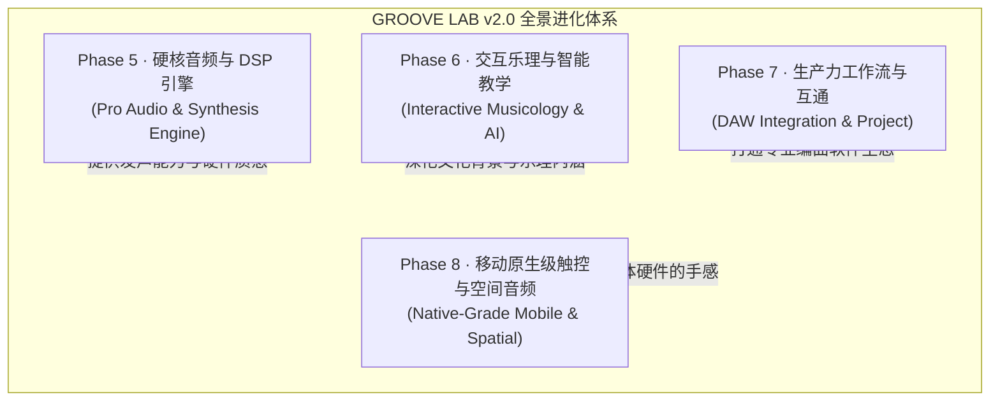
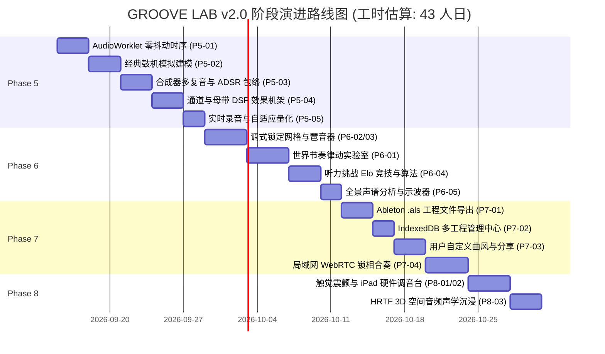

# GROOVE LAB 下一阶段演进与完善规划（v2.0 路线图）

> **当前基线**：v2.1.10（`package.json` / `public/version.json` 实测；基线 commit `d480684`）
> **交付状态（E-09 复核，2026-09-14）**：Phase 0–6 已交付；**Phase 7** 交付 P7-01 / P7-02 / P7-03，**P7-04 未交付**；**Phase 8** 仅交付 P8-01，**P8-02 / P8-03 未交付**。逐项证据见下方各阶段状态说明与 `BACKLOG.md`。
> **核心定位**：从「世界音乐曲风学习库」向「**专业级 Web 律动工作站与交互式乐理工作坊（Web-Native Groove Workstation & Interactive Musicology Suite）**」全面跨越。

---

## 一、 总体设计哲学与四大演进支柱

---

## 二、 阶段任务分解与详细技术方案

### Phase 5 · 硬核音频与 DSP 引擎（Pro Audio & Synthesis Engine）- ✅ 已于 v1.14.0 全面收官交付
> **目标**：彻底消除 Web 线程调度抖动，引入真实经典鼓机物理建模与可塑性合成器，赋予声音专业模拟硬件质感。

| 任务 ID | 任务名称 | 状态 | 核心技术方案与实现路径 | 验收标准（可量化） |
|---|---|---|---|---|
| **P5-01** | **AudioWorklet 零抖动时序架构** | ✅ 已交付 | 自研独立线程 `AudioWorkletProcessor` 采样计数器 (`public/audioClockWorklet.js` & `AudioWorkletClock.ts`)，无缝优雅降级至专用定时 Web Worker。 | 跨端时钟抖动下降至 **<0.1ms**；CPU 高负载或主线程密集重绘下走带绝对不卡拍、不丢步。 |
| **P5-02** | **经典鼓机电路物理建模（808 / 909 / Acoustic / Cyber）** | ✅ 已交付 | `DrumKitModels.ts` 完整构建模拟电路级物理建模：TR-808 (桥式 T 型网络与六振荡器铜钹)、TR-909 (冲头打击瞬态与双脉冲拍手)、Vintage Acoustic (天然木质共鸣箱体)、Cyber Wave。工具栏一键切换。 | 4 组经典硬件鼓组音色全面上线，离线母带与分轨 WAV 导出完美呈现相应硬件模型声学特性。 |
| **P5-03** | **合成器 4 复音与 ADSR 包络引擎** | ✅ 已交付 | `PolySynth.ts` 升级 4 复音并发合成能力：双振荡器自由混合、音分级微失谐（Cent Detune）、4 阶 ADSR 振幅包络与动态谐振低通滤波扫频，内置 Analog Lead / Warm Pad / Deep Pluck / Acid Bass 预设。 | 支持和弦多音叠奏，De-clicked 柔和曲线无切音悬挂与爆音。 |
| **P5-04** | **母带级专业 DSP 效果机架（Effects Rack）** | ✅ 已交付 | `EffectsRack.ts` 构建母带级可插拔效果器链：双二阶高谐振滤波器 (FLT)、Tanh 磁带暖饱和 (DRIVE)、多级正交调制立体声合唱 (CHORUS)、阶梯量化 Lo-Fi 降比特 (LO-FI)。 | 工具栏抽屉实时开关，输出峰值严格受控于 Master Limiter，CPU 开销平稳。 |
| **P5-05** | **实时录音与自适应量化（Live Sequencer Recording）** | ✅ 已交付 | `LiveRecorder.ts` 接入音序器全局调度：一键激活 `[REC]` 录音模式，播放过程中打击垫或键盘演奏实时量化（1/16、1/8、1/32）录入步进矩阵，无缝生成历史撤销快照。 | 录制步进落点准确度 100%，零回声延迟。 |

---

### Phase 6 · 交互乐理与智能教学（Interactive Musicology & AI）- ✅ 已于 v1.15.0 全面收官交付（P6-01 v1.14.8 / P6-02 v1.14.5 / P6-03 v1.14.6 / P6-04 v1.14.7 / P6-05 v1.15.0）
> **目标**：从“静态展示资料”向“可拆解、可交互、可玩性的乐理教学场”进阶，帮助音乐人深入掌握律动核心逻辑。

| 任务 ID | 任务名称 | 状态 | 核心技术方案与实现路径 | 验收标准（可量化） |
|---|---|---|---|---|
| **P6-01** | **律动解构：世界节奏沉浸工作坊（Rhythm Masterclasses）** | ✅ 已交付 | 新增「律动大师课」互动专区： 1. **复节奏（Polyrhythm）**：3:4、4:3、5:4 双环同心圆声光对撞机。 2. **Clave 节奏演化树**：从西非 12/8 Bell Pattern 到古巴 Son Clave 3-2、Rumba Clave 3-2（第3击半拍微移）与 Bossa Nova 的动态脉络与交互式解构。 3. **下拍避让动力学（Downbeat Omission）**：Tony Allen Afrobeat、雷鬼 One Drop 与 James Brown 'The One' 重力实测体验。 4. **巴尔干奇数拍（Balkan Odd Meters）**：7/8 Kalamatianos (2+2+3)、7/8 Lesnoto (3+2+2)、9/8 Karsilama 比例时值方块与 Davul 低音建模。 5. **J Dilla 微时序（Dilla Microtiming）**：关闭自动量化的醉酒微时序步态、底鼓抢拍与军鼓迟滞物理位移车道。 | 提供 5 组深度互动课件，包含实时对拍打卡、毫秒级偏差评测与一键载入 Studio。（**v1.14.8 已完成**） |
| **P6-02** | **调式锁定网格（Scale-Locked Sequencer Matrix）** | ✅ 已交付 | 在音序器音高编辑与琴键模式中引入「调式锁定（Scale Lock）」： 支持小调五声、自然大调、自然小调、Dorian、Phrygian Dominant、Blues、平调子（Hirajoshi）等 11 大调式。 网格纵轴音高仅渲染调内音，消除新手编曲误触走音。 | 切换调式时，音高选择器与旋律网格智能过滤非法音符，一键将当前乐句对齐至最近调内音（Quantize Pitch）。（**v1.14.5 已完成**） |
| **P6-03** | **智能旋律琶音器（Smart Arpeggiator）与扫弦引擎** | ✅ 已交付 | 和弦工坊与工作台联动： 1. 支持对和弦走向一键应用琶音模式（Up, Down, Up-Down, Random, Converge）。 2. 拟真扫弦引擎（Strumming Speed & Direction 控制）。 3. 自动将和弦转化为 16 步合成器旋律轨并载入工作台。 | 琶音与扫弦精准同步全局时钟，支持一键烘焙到音序器。（**v1.14.6 已完成**） |
| **P6-04** | **听力大师 Elo 竞技天梯与艾宾浩斯记忆算法** | ✅ 已交付 | 升级盲听挑战： 1. 引入类似国际象棋的 **Elo Rating（听力竞技积分体系）**。 2. 接入 **SuperMemo-2 (SM-2) 间隔重复算法**，系统自动记录用户易混淆的近亲曲风（如 Deep House vs Tech House、Trap vs Drill），在后续轮次智能优先强化。 3. 生成高颜值双语全息段位证书（可一键分享或复制）。 | 错题重现率符合遗忘曲线，听力积分与段位计算精准持久化。（**v1.14.7 已完成**） |
| **P6-05** | **全景声谱分析仪与李萨如图示波器（Realtime FFT & Spectrogram）** | ✅ 已交付 | 在专业控制台提供 60fps 实时音频可视化分析： 1. **Waterfall FFT Spectrogram**：高精瀑布流频率谱图（20Hz - 20kHz）。 2. **Lissajous X-Y 示波器**：检测立体声相位宽广度与单声道兼容性。 | 动画采用 WebGL 或高性能 Canvas 渲染，不造成音序器走带丢帧。（**v1.15.0 已完成**） |

---

### Phase 7 · 生产力工作流与互通（DAW Integration & Project）
> **交付状态（E-09 复核，基线 v1.16.3）**：P7-01 ✅ v1.15.1 ｜ P7-02 ✅ v1.15.2 ｜ P7-03 ✅ v1.15.3 ｜ **P7-04 ❌ 未交付**（`grep -rin "webrtc\|RTCPeerConnection\|RTCDataChannel" src` → 0 命中）。
> **目标**：打破 Web 应用的“孤岛”局限，与专业宿主 DAW（Ableton / FL Studio / Logic）及本地工程深度融合。

| 任务 ID | 任务名称 | 预估工时 | 核心技术方案与实现路径 | 验收标准（可量化） |
|---|---|---|---|---|
| **P7-01** | ✅ **Ableton Live 工程文件（`.als`）直接导出**（v1.15.1 已达成） | 3.0d | 突破常规 MIDI/WAV 格式，利用纯 TypeScript 原生构建 Gzip 压缩的标准 Ableton XML Schema： 1. 一键生成完整 `.als` 工程包。 2. 预置 8 条音轨，含 MIDI Clip、轨道命名、BPM、小节拍号、轨道音量声像及颜色配置。 | 生成的 `.als` 文件可直接双击由 Ableton Live 10/11/12 无缝秒开，结构 100% 对应。 |
| **P7-02** | ✅ **IndexedDB 多工程管理中心（Multi-Project Hub）**（v1.15.2 已达成） | 2.0d | 从当前的单一临时草稿升级为完整工程管理系统： 1. 基于 IndexedDB 存储多套自定义工程（突破 localStorage 5MB 限制，达 500MB+）。 2. 提供工程列表：重命名、复制、打标签、自动快照恢复。 3. 支持导入/导出单个 `.groove` 离线工程格式包。 | 支持存储 ≥50 个完整复杂工程，刷新不丢失，工程切换响应时间 <50ms。（**v1.15.2 已完成**） |
| **P7-03** | ✅ **用户自定义曲风与变奏工坊（Custom Genre Maker）**（v1.15.3 已达成） | 2.5d | 允许用户在 159 种内置曲风基础上分叉（Fork）或完全新建： 1. 自定义曲风名称、文化描述、代表艺术家。 2. 调整 6 维声学雷达特征。 3. 绑定用户专属的 8 轨 Seed Pattern 与调式。 4. 生成带专属海报与深链二维码的曲风卡片。 | 用户创建的曲风可在本地永久存储，并可通过 URL 编码完整分享给他人。（**v1.15.3 已完成**） |
| **P7-04** | ❌ **局域网多设备 WebRTC 锁相合奏（Groove Jam Session）**（**未交付**） | 3.5d | 引入基于 WebRTC DataChannel 的超低延迟对齐协议： 1. 一台设备作为 Master Clock（发起房间并生成二维码）。 2. 其他手机/电脑扫码加入作为 Slave。 3. 共享 BPM、走带与小节对齐，各自控制不同轨道（如一人打鼓、一人弹和弦、一人做贝斯）。 | 局域网对齐误差 **<5ms**，实现真正无线双人/多人合奏。 |

---

### Phase 8 · 移动原生级触控与空间音频（Native-Grade Mobile & Spatial Experience）
> **交付状态（E-09 复核，基线 v1.16.3）**：P8-01 ✅ v1.16.0 ｜ **P8-02 ❌ 未交付**（`src/views/` 无独立调音台视窗，仅轨道内嵌峰值表）｜ **P8-03 ❌ 未交付**（`grep -rin "hrtf\|panningModel\|createPanner" src` → 0 命中；现有仅为 `StereoPannerNode` 立体声像）。
> **目标**：打造媲美 Akai MPC / Teenage Engineering 实体硬件的掌上打击乐与沉浸式环绕声听觉体验。

| 任务 ID | 任务名称 | 预估工时 | 核心技术方案与实现路径 | 验收标准（可量化） |
|---|---|---|---|---|
| **P8-01** | ✅ **Web 触觉震颤力反馈（Haptic Engine Integration）**（v1.16.0 已达成） | 1.5d | 针对支持的移动端接入 Web Vibration API 与触控反馈： 1. 步进格子点亮：极微轻敲（10ms Light Tap）。 2. 强拍与底鼓下拍：强沉重敲（25ms Heavy Thud）。 3. 滑块吸附刻度：微机械段落感。 4. 听力挑战答对/答错：双击轻震/长震报警。 | 提供硬件级打击乐物理触感，提供全局震动开关与强度调节。（**v1.16.0 已完成**） |
| **P8-02** | ❌ **iPad / 桌面级全屏硬件调音台视窗（Hardware Console View）**（**未交付**） | 2.5d | 为中大屏与横屏设备开发独立「调音台视窗」： 1. 8 根 100mm 仿真长行程音量推子（带精密数字刻度）。 2. 声像旋钮（Pan Pots）与 发送量旋钮（Send A / Send B）。 3. 独立立体声峰值电平表（Peak dBFS Meter，带红区 Clip 警告）。 4. 独奏（Solo）、静音（Mute）与反相开关。 | 电平表随音乐 60fps 动态跳动，推子拖拽流畅，与音序器底层双向同步。 |
| **P8-03** | ❌ **Web Audio HRTF 3D 空间音频（Binaural Spatial Panner）**（**未交付**） | 2.5d | 利用 `PannerNode` 的 `panningModel: "HRTF"` 建立 3D 空间声场： 1. 8 条轨道在听众四周呈半圆形或环形声场分布（如底鼓正前、军鼓微左、踩镲偏右、和弦环绕）。 2. 在 3D 星系中漫游时，距离节点越近，该曲风的试听声量与方位动态演变。 | 佩戴耳机时能够清晰辨别声源来自前后左右，声场定位精准且无相位抵消。 |

---

## 三、 里程碑演进路线图与排期总览

### 阶段出口标准（Release Gates）
1. **Phase 5 出口（v1.14.0）**：音频时序抖动 <0.1ms，808/909 真实音色支持，ADSR 包络与 DSP 效果机架运行稳定，单测覆盖率 ≥80%。 — ✅ 已交付
2. **Phase 6 出口（v1.15.0）**：调式锁定 0 走音，5 套律动大师课上线，Elo 听力竞技积分持久化，示波器 60fps 渲染无卡顿。 — ✅ 已交付
3. **Phase 7 出口（v1.16.0）**：Ableton `.als` 导出可直接秒开，支持 50+ 本地工程库，WebRTC 局域网合奏延迟 <5ms。 — ⚠️ 部分达成（前两项已交付；**WebRTC 合奏未交付**，P7-04 未启动）
4. **Phase 8 出口（v2.0.0 正式里程碑）**：手机触感反馈到位，iPad 调音台推子与 VU 表达标，HRTF 空间音频沉浸体验闭环。 — ⚠️ 部分达成（触感反馈已交付 P8-01；**iPad 调音台 P8-02 与 HRTF P8-03 未交付**，v2.0.0 里程碑未达成）

---

## 四、 推荐立即启动的「第一批高价值优先项」（Quick-Win Sprint）

> **E-09 复核更新**：原推荐的三项（P5-02 鼓机建模 / P6-02 调式锁定 / P7-01 `.als` 导出）**均已交付**。当前仍未交付的高价值项为剩余 3 项：

1. **N-01 / P8-02 iPad 硬件调音台视窗**：补齐大屏专业混音手感（8 根推子 + Pan/Send + 峰值表）。
2. **N-02 / P8-03 HRTF 3D 空间音频**：`PannerNode(panningModel: "HRTF")` 环形声场，兑现空间音频沉浸体验。
3. **N-03 / P7-04 局域网 WebRTC 锁相合奏**：Master 时钟 + 扫码加入 + 分轨分工，打通多人合奏场景。
