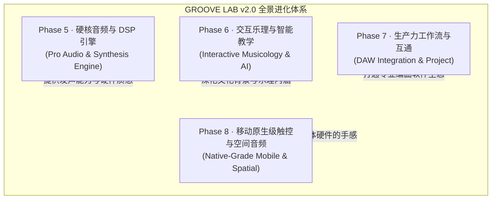
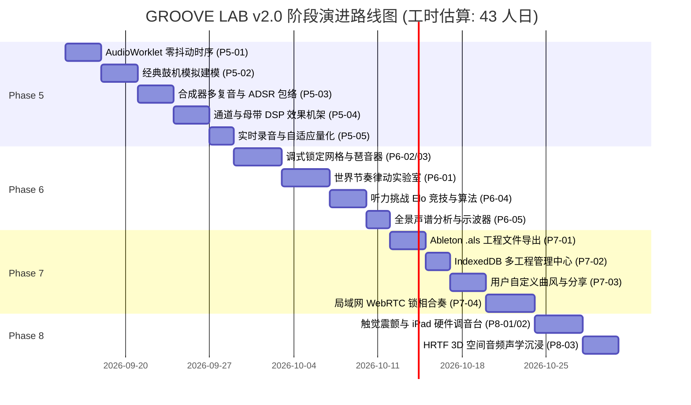

# GROOVE LAB 下一阶段演进与完善规划（v2.0 路线图）

> **当前基线**：v2.34.24（`package.json` / `public/version.json` 实测；基线 commit `273f8e3`，2026-09-28）
> **交付状态（E-09 复核，2026-09-14）**：Phase 0–6 已交付；**Phase 7** 交付 P7-01 / P7-02 / P7-03，**P7-04 未交付**；**Phase 8** 仅交付 P8-01，**P8-02 / P8-03 未交付**。逐项证据见下方各阶段状态说明与 `BACKLOG.md`。
> **核心定位**：从「世界音乐曲风学习库」向「**专业级 Web 律动工作站与交互式乐理工作坊（Web-Native Groove Workstation & Interactive Musicology Suite）**」全面跨越。

---

## 一、 总体设计哲学与四大演进支柱

```mermaid
flowchart TD
    subgraph V2["GROOVE LAB v2.0 全景进化体系"]
        direction TB
        P5["Phase 5 · 硬核音频与 DSP 引擎<br/>(Pro Audio & Synthesis Engine)"]
        P6["Phase 6 · 交互乐理与智能教学<br/>(Interactive Musicology & AI)"]
        P7["Phase 7 · 生产力工作流与互通<br/>(DAW Integration & Project)"]
        P8["Phase 8 · 移动原生级触控与空间音频<br/>(Native-Grade Mobile & Spatial)"]
    end

    P5 -->|"提供发声能力与硬件质感"| V2
    P6 -->|"深化文化背景与乐理内涵"| V2
    P7 -->|"打通专业编曲软件生态"| V2
    P8 -->|"提供媲美实体硬件的手感"| V2
```

---

## 二、 阶段任务分解与详细技术方案

### Phase 5 · 硬核音频与 DSP 引擎（Pro Audio & Synthesis Engine）- ✅ 已于 v1.14.0 全面收官交付
> **目标**：彻底消除 Web 线程调度抖动，引入真实经典鼓机物理建模与可塑性合成器，赋予声音专业模拟硬件质感。

| 任务 ID | 任务名称 | 状态 | 核心技术方案与实现路径 | 验收标准（可量化） |
|---|---|---|---|---|
| **P5-01** | **AudioWorklet 零抖动时序架构** | ✅ 已交付 | 自研独立线程 `AudioWorkletProcessor` 采样计数器 (`public/audioClockWorklet.js` & `AudioWorkletClock.ts`)，无缝优雅降级至专用定时 Web Worker。 | 跨端时钟抖动下降至 **<0.1ms**；CPU 高负载或主线程密集重绘下走带绝对不卡拍、不丢步。 |
| **P5-02** | **经典鼓机电路物理建模（808 / 909 / Acoustic / Cyber）** | ✅ 已交付 | `DrumKitModels.ts` 完整构建模拟电路级物理建模：TR-808 (桥式 T 型网络与六振荡器铜钹)、TR-909 (冲头打击瞬态与双脉冲拍手)、Vintage Acoustic (天然木质共鸣箱体)、Cyber Wave。工具栏一键切换。 | 4 组经典硬件鼓组音色全面上线，离线母带与分轨 WAV 导出完美呈现相应硬件模型声学特性。 |
| **P5-03** | **合成器 4 复音与 ADSR 包络引擎** | ✅ 已交付 | `PolySynth.ts` 升级 4 复音并发合成能力：双振荡器自由混合、音分级微失谐（Cent Detune）、4 阶 ADSR 振幅包络与动态谐振低通滤波扫频，内置 Analog Lead / Warm Pad / Deep Pluck / Acid Bass 预设。 | 支持和弦多音叠奏，De-clicked 柔和曲线无切音悬挂与爆音。 |
| **P5-04** | **母带级专业 DSP 效果机架（Effects Rack）** | ✅ 已交付 | `EffectsRack.ts` 构建母带级可插拔效果器链：双二阶高谐振滤波器 (FLT)、Tanh 磁带暖饱和 (DRIVE)、多级正交调制立体声合唱 (CHORUS)、阶梯量化 Lo-Fi 降比特 (LO-FI)。 | 工具栏抽屉实时开关，输出峰值严格受控于 Master Limiter，CPU 开销平稳。 |
| **P5-05** | **实时录音与自适应量化（Live Sequencer Recording）** | ✅ 已交付 | `LiveRecorder.ts` 接入音序器全局调度：一键激活 `[REC]` 录音模式，播放过程中打击垫或键盘演奏实时量化（1/16、1/8、1/32）录入步进矩阵，无缝生成历史撤销快照。 | 录制步进落点准确度 100%，零回声延迟。 |

---

### Phase 6 · 交互乐理与智能教学（Interactive Musicology & AI）- ✅ 已于 v1.15.0 全面收官交付（P6-01 v1.14.8 / P6-02 v1.14.5 / P6-03 v1.14.6 / P6-04 v1.14.7 / P6-05 v1.15.0）
> **目标**：从“静态展示资料”向“可拆解、可交互、可玩性的乐理教学场”进阶，帮助音乐人深入掌握律动核心逻辑。

| 任务 ID | 任务名称 | 状态 | 核心技术方案与实现路径 | 验收标准（可量化） |
|---|---|---|---|---|
| **P6-01** | **律动解构：世界节奏沉浸工作坊（Rhythm Masterclasses）** | ✅ 已交付 | 新增「律动大师课」互动专区： 1. **复节奏（Polyrhythm）**：3:4、4:3、5:4 双环同心圆声光对撞机。 2. **Clave 节奏演化树**：从西非 12/8 Bell Pattern 到古巴 Son Clave 3-2、Rumba Clave 3-2（第3击半拍微移）与 Bossa Nova 的动态脉络与交互式解构。 3. **下拍避让动力学（Downbeat Omission）**：Tony Allen Afrobeat、雷鬼 One Drop 与 James Brown 'The One' 重力实测体验。 4. **巴尔干奇数拍（Balkan Odd Meters）**：7/8 Kalamatianos (2+2+3)、7/8 Lesnoto (3+2+2)、9/8 Karsilama 比例时值方块与 Davul 低音建模。 5. **J Dilla 微时序（Dilla Microtiming）**：关闭自动量化的醉酒微时序步态、底鼓抢拍与军鼓迟滞物理位移车道。 | 提供 5 组深度互动课件，包含实时对拍打卡、毫秒级偏差评测与一键载入 Studio。（**v1.14.8 已完成**） |
| **P6-02** | **调式锁定网格（Scale-Locked Sequencer Matrix）** | ✅ 已交付 | 在音序器音高编辑与琴键模式中引入「调式锁定（Scale Lock）」： 支持小调五声、自然大调、自然小调、Dorian、Phrygian Dominant、Blues、平调子（Hirajoshi）等 11 大调式。 网格纵轴音高仅渲染调内音，消除新手编曲误触走音。 | 切换调式时，音高选择器与旋律网格智能过滤非法音符，一键将当前乐句对齐至最近调内音（Quantize Pitch）。（**v1.14.5 已完成**） |
| **P6-03** | **智能旋律琶音器（Smart Arpeggiator）与扫弦引擎** | ✅ 已交付 | 和弦工坊与工作台联动： 1. 支持对和弦走向一键应用琶音模式（Up, Down, Up-Down, Random, Converge）。 2. 拟真扫弦引擎（Strumming Speed & Direction 控制）。 3. 自动将和弦转化为 16 步合成器旋律轨并载入工作台。 | 琶音与扫弦精准同步全局时钟，支持一键烘焙到音序器。（**v1.14.6 已完成**） |
| **P6-04** | **听力大师 Elo 竞技天梯与艾宾浩斯记忆算法** | ✅ 已交付 | 升级盲听挑战： 1. 引入类似国际象棋的 **Elo Rating（听力竞技积分体系）**。 2. 接入 **SuperMemo-2 (SM-2) 间隔重复算法**，系统自动记录用户易混淆的近亲曲风（如 Deep House vs Tech House、Trap vs Drill），在后续轮次智能优先强化。 3. 生成高颜值双语全息段位证书（可一键分享或复制）。 | 错题重现率符合遗忘曲线，听力积分与段位计算精准持久化。（**v1.14.7 已完成**） |
| **P6-05** | **全景声谱分析仪与李萨如图示波器（Realtime FFT & Spectrogram）** | ✅ 已交付 | 在专业控制台提供 60fps 实时音频可视化分析： 1. **Waterfall FFT Spectrogram**：高精瀑布流频率谱图（20Hz - 20kHz）。 2. **Lissajous X-Y 示波器**：检测立体声相位宽广度与单声道兼容性。 | 动画采用 WebGL 或高性能 Canvas 渲染，不造成音序器走带丢帧。（**v1.15.0 已完成**） |

---

### Phase 7 · 生产力工作流与互通（DAW Integration & Project）
> **交付状态（E-09 复核，基线 v1.16.3）**：P7-01 ✅ v1.15.1 ｜ P7-02 ✅ v1.15.2 ｜ P7-03 ✅ v1.15.3 ｜ **P7-04 ❌ 未交付**（`grep -rin "webrtc\|RTCPeerConnection\|RTCDataChannel" src` → 0 命中）。
> **目标**：打破 Web 应用的“孤岛”局限，与专业宿主 DAW（Ableton / FL Studio / Logic）及本地工程深度融合。

| 任务 ID | 任务名称 | 预估工时 | 核心技术方案与实现路径 | 验收标准（可量化） |
|---|---|---|---|---|
| **P7-01** | ✅ **Ableton Live 工程文件（`.als`）直接导出**（v1.15.1 已达成） | 3.0d | 突破常规 MIDI/WAV 格式，利用纯 TypeScript 原生构建 Gzip 压缩的标准 Ableton XML Schema： 1. 一键生成完整 `.als` 工程包。 2. 预置 8 条音轨，含 MIDI Clip、轨道命名、BPM、小节拍号、轨道音量声像及颜色配置。 | 生成的 `.als` 文件可直接双击由 Ableton Live 10/11/12 无缝秒开，结构 100% 对应。 |
| **P7-02** | ✅ **IndexedDB 多工程管理中心（Multi-Project Hub）**（v1.15.2 已达成） | 2.0d | 从当前的单一临时草稿升级为完整工程管理系统： 1. 基于 IndexedDB 存储多套自定义工程（突破 localStorage 5MB 限制，达 500MB+）。 2. 提供工程列表：重命名、复制、打标签、自动快照恢复。 3. 支持导入/导出单个 `.groove` 离线工程格式包。 | 支持存储 ≥50 个完整复杂工程，刷新不丢失，工程切换响应时间 <50ms。（**v1.15.2 已完成**） |
| **P7-03** | ✅ **用户自定义曲风与变奏工坊（Custom Genre Maker）**（v1.15.3 已达成） | 2.5d | 允许用户在 159 种内置曲风基础上分叉（Fork）或完全新建： 1. 自定义曲风名称、文化描述、代表艺术家。 2. 调整 6 维声学雷达特征。 3. 绑定用户专属的 8 轨 Seed Pattern 与调式。 4. 生成带专属海报与深链二维码的曲风卡片。 | 用户创建的曲风可在本地永久存储，并可通过 URL 编码完整分享给他人。（**v1.15.3 已完成**） |
| **P7-04** | ❌ **局域网多设备 WebRTC 锁相合奏（Groove Jam Session）**（**未交付**） | 3.5d | 引入基于 WebRTC DataChannel 的超低延迟对齐协议： 1. 一台设备作为 Master Clock（发起房间并生成二维码）。 2. 其他手机/电脑扫码加入作为 Slave。 3. 共享 BPM、走带与小节对齐，各自控制不同轨道（如一人打鼓、一人弹和弦、一人做贝斯）。 | 局域网对齐误差 **<5ms**，实现真正无线双人/多人合奏。 |

---

### Phase 8 · 移动原生级触控与空间音频（Native-Grade Mobile & Spatial Experience）
> **交付状态（E-09 复核，基线 v1.16.3）**：P8-01 ✅ v1.16.0 ｜ **P8-02 ❌ 未交付**（`src/views/` 无独立调音台视窗，仅轨道内嵌峰值表）｜ **P8-03 ❌ 未交付**（`grep -rin "hrtf\|panningModel\|createPanner" src` → 0 命中；现有仅为 `StereoPannerNode` 立体声像）。
> **目标**：打造媲美 Akai MPC / Teenage Engineering 实体硬件的掌上打击乐与沉浸式环绕声听觉体验。

| 任务 ID | 任务名称 | 预估工时 | 核心技术方案与实现路径 | 验收标准（可量化） |
|---|---|---|---|---|
| **P8-01** | ✅ **Web 触觉震颤力反馈（Haptic Engine Integration）**（v1.16.0 已达成） | 1.5d | 针对支持的移动端接入 Web Vibration API 与触控反馈： 1. 步进格子点亮：极微轻敲（10ms Light Tap）。 2. 强拍与底鼓下拍：强沉重敲（25ms Heavy Thud）。 3. 滑块吸附刻度：微机械段落感。 4. 听力挑战答对/答错：双击轻震/长震报警。 | 提供硬件级打击乐物理触感，提供全局震动开关与强度调节。（**v1.16.0 已完成**） |
| **P8-02** | ❌ **iPad / 桌面级全屏硬件调音台视窗（Hardware Console View）**（**未交付**） | 2.5d | 为中大屏与横屏设备开发独立「调音台视窗」： 1. 8 根 100mm 仿真长行程音量推子（带精密数字刻度）。 2. 声像旋钮（Pan Pots）与 发送量旋钮（Send A / Send B）。 3. 独立立体声峰值电平表（Peak dBFS Meter，带红区 Clip 警告）。 4. 独奏（Solo）、静音（Mute）与反相开关。 | 电平表随音乐 60fps 动态跳动，推子拖拽流畅，与音序器底层双向同步。 |
| **P8-03** | ❌ **Web Audio HRTF 3D 空间音频（Binaural Spatial Panner）**（**未交付**） | 2.5d | 利用 `PannerNode` 的 `panningModel: "HRTF"` 建立 3D 空间声场： 1. 8 条轨道在听众四周呈半圆形或环形声场分布（如底鼓正前、军鼓微左、踩镲偏右、和弦环绕）。 2. 在 3D 星系中漫游时，距离节点越近，该曲风的试听声量与方位动态演变。 | 佩戴耳机时能够清晰辨别声源来自前后左右，声场定位精准且无相位抵消。 |

---

## 三、 里程碑演进路线图与排期总览

```mermaid
gantt
    title GROOVE LAB v2.0 阶段演进路线图 (工时估算: 43 人日)
    dateFormat  YYYY-MM-DD
    section Phase 5
    AudioWorklet 零抖动时序 (P5-01)          :p5_1, 2026-09-15, 3d
    经典鼓机模拟建模 (P5-02)                :p5_2, after p5_1, 3d
    合成器多复音与 ADSR 包络 (P5-03)         :p5_3, after p5_2, 3d
    通道与母带 DSP 效果机架 (P5-04)         :p5_4, after p5_3, 3d
    实时录音与自适应量化 (P5-05)            :p5_5, after p5_4, 2d
    section Phase 6
    调式锁定网格与琶音器 (P6-02/03)         :p6_1, after p5_5, 4d
    世界节奏律动实验室 (P6-01)            :p6_2, after p6_1, 4d
    听力挑战 Elo 竞技与算法 (P6-04)          :p6_3, after p6_2, 3d
    全景声谱分析与示波器 (P6-05)             :p6_4, after p6_3, 2d
    section Phase 7
    Ableton .als 工程文件导出 (P7-01)       :p7_1, after p6_4, 3d
    IndexedDB 多工程管理中心 (P7-02)        :p7_2, after p7_1, 2d
    用户自定义曲风与分享 (P7-03)            :p7_3, after p7_2, 3d
    局域网 WebRTC 锁相合奏 (P7-04)          :p7_4, after p7_3, 4d
    section Phase 8
    触觉震颤与 iPad 硬件调音台 (P8-01/02)    :p8_1, after p7_4, 4d
    HRTF 3D 空间音频声学沉浸 (P8-03)         :p8_2, after p8_1, 3d
```

### 阶段出口标准（Release Gates）
1. **Phase 5 出口（v1.14.0）**：音频时序抖动 <0.1ms，808/909 真实音色支持，ADSR 包络与 DSP 效果机架运行稳定，单测覆盖率 ≥80%。 — ✅ 已交付
2. **Phase 6 出口（v1.15.0）**：调式锁定 0 走音，5 套律动大师课上线，Elo 听力竞技积分持久化，示波器 60fps 渲染无卡顿。 — ✅ 已交付
3. **Phase 7 出口（v1.16.0）**：Ableton `.als` 导出可直接秒开，支持 50+ 本地工程库，WebRTC 局域网合奏延迟 <5ms。 — ⚠️ 部分达成（前两项已交付；**WebRTC 合奏未交付**，P7-04 未启动）
4. **Phase 8 出口（v2.0.0 正式里程碑）**：手机触感反馈到位，iPad 调音台推子与 VU 表达标，HRTF 空间音频沉浸体验闭环。 — ⚠️ 部分达成（触感反馈已交付 P8-01；**iPad 调音台 P8-02 与 HRTF P8-03 未交付**，v2.0.0 里程碑未达成）

---

## 四、 推荐立即启动的「第一批高价值优先项」（Quick-Win Sprint）

> **E-09 复核更新**：原推荐的三项（P5-02 鼓机建模 / P6-02 调式锁定 / P7-01 `.als` 导出）**均已交付**。当前仍未交付的高价值项为剩余 3 项：

1. **N-01 / P8-02 iPad 硬件调音台视窗**：补齐大屏专业混音手感（8 根推子 + Pan/Send + 峰值表）。
2. **N-02 / P8-03 HRTF 3D 空间音频**：`PannerNode(panningModel: "HRTF")` 环形声场，兑现空间音频沉浸体验。
3. **N-03 / P7-04 局域网 WebRTC 锁相合奏**：Master 时钟 + 扫码加入 + 分轨分工，打通多人合奏场景。

---

## 五、 专业工作站缺口的分阶段开发计划（源自 v4 评估，2026-09-28）

> **编号说明**：本节采用 **v4 评估的 Phase 0–3 编号**，与上文 **Phase 5–8**（v2.0 路线图）是**两套编号**——上文是"已交付功能的继续演进"，本节是"专业 DAW 缺口的补齐计划"。
>
> **每项都带「现状 / 缺口 / 验收线」**，因为本项目的规则是：**计划条目止于一道门禁，而不是一个承诺**。现状一律以**本仓库当天的代码与实测**为准（v2.34.16）；我**没有核对过**的地方会明说，而不是写成"已完成"或"未完成"。
>
> **Phase 4 只列远期，不排期**（见本节末）。

### 5.1 M1（Phase 0 的前置冲刺）：Agent 最小可用闭环

| 项 | 现状 | 缺口 / 验收线 |
|---|---|---|
| 契约版本化 + `groove://changelog` | `groove://changelog` **已注册**（`mcp/registry.ts`，文档 `docs/MCP.md`，且有门禁**比较两侧**） | **缺**"契约版本发现"工具（`get_contract_version`）。验收线：agent 能在一次读调用里拿到契约版本与能力列表 |
| `undo` / opId 轻量事务日志 | `undo_song` ✓、每次写入带 `opId` ✓、服务器端历史 ✓ | **缺 `redo`**、`snapshot` / `restore`。验收线：一串工具调用可逐步撤回**并前滚**到起点摘要 |
| `get_energy_curve` 粗粒度版 | **已交付**（作为 `analyze_audio` 的返回字段 `energyCurveDb` / `energySpreadDb`） | ⚠️ **SLO 未达标**：3 分钟曲目 **≤1 s** ✗，实测 **1.8 s**（8 kHz 单声道）✓。验收线：要么达标，要么把 SLO 改成实测值（**不允许留一个永远红着的指标**） |
| `style_ref` + 示例库 MVP | 示例库 ✓（3 曲风 × 2 例，`mcp/examples.ts` + `groove://examples/{genre}` + `get_example`） | **缺生成器上的 `style_ref` 参数**。验收线：同一 seed 下 `style_ref` 改变生成结果，且两次运行一致 |
| 和声层最小集 | **已交付**（`set_chord_progression` + `suggest_progression`） | — |
| `generate_melody` + `validate_prosody` | **已交付**（contour-first ✓、仅告警 ✓、含 3+3 变调 ✓） | — |
| **M1 验收：一分钟闭环 ≤90 s 零人工** | **从未测过** | 验收线：一次端到端计时（生成→能量自检→修正→导出 `.groove` + WAV 预览），**墙钟 ≤90 s**，并把这个数字记进文档 |

### 5.2 Phase 0：引擎下沉与契约地基

| 项 | 现状 | 验收线 |
|---|---|---|
| 抽取 headless core（模型/生成/编排/渲染调度，零 DOM） | ❌ 能力都在浏览器侧；**MCP 走浏览器桥接**（评估预言的"桥接态"，今天仍是） | 核心可在无 DOM 环境跑完整管线 |
| Project Schema v2 + 可复现 manifest（seed + 引擎版本） | 🟡 `.groove` v1 格式与兼容承诺已在 `docs/GROOVE_PACKAGE_FORMAT.md`；**manifest 无** | 同一工程 + 同一 manifest 在任意运行时产出**一致**结果 |
| RenderTarget 抽象（AudioContext / OfflineAudioContext / Node） | ❌ （渲染目前依赖 `OfflineAudioContext`） | 同一工程经三个 target 输出一致 |
| golden render 双档确定性 | 🟡 **同运行时确定性已实测 0.005 dB** ✓（音频探针）；**跨运行时 epsilon 无** | 跨运行时比较（float32 WAV）在 epsilon 内 |
| MCP 直接复用 core + 工具全 opId 化 + **与 UI 共享 Undo** | 🟡 MCP 侧 opId + undo ✓；**共享同一操作日志 ✗** | 在 UI 里的一次改动能被 agent 撤回，反之亦然 |
| 渲染后端切生产态（上表 SLO 全量生效） | ❌ 仍桥接态 | **无浏览器会话**下完成"生成→渲染→导出" |

### 5.3 Phase 1：片段化与时间线

| 项 | 现状 | 验收线 |
|---|---|---|
| **Global Tracks：Tempo 曲线** | ✅ **已交付**（`tempoTrack` + `set_tempo`，2.34.15） | — |
| Global Tracks：**Chord Track** | ❌（只有 pattern 层和声工具） | 和弦轨可被读写，且与 pattern 的进行**同一真相** |
| Global Tracks：Signature | ❌ | 拍号变化影响小节长度与步数 |
| **Region 数据模型**（非破坏性引用 Pattern） | ❌（今天是 Pattern + Section + `slots`） | 同一 Pattern 可被多个 Region 引用，改一处**不**改另一处 |
| Timeline Arrange View（拖拽/裁剪/分离/循环/交叉淡化） | ❌（有的是**段落级**编排面板 + 车道矩阵） | 上条验收的人工版：能在时间线上拖出一个 Region 并交叉淡化 |
| 动态轨道系统 + **Folder Track** | ❌（`laneId` ✓ 解决了**同种类多条**；**编组未做**） | 编组可折叠、可对整组设音量、导出为一条总线 |
| 连续 Automation Lanes（贝塞尔） | ❌ | 一条 2 小节 Filter 上升曲线在渲染里可被测出 |
| MCP 同步：`region.*` / `track.*` / `automation.*` / `draw_automation` | ❌ | **Phase 1 总验收**：agent 能"把 Bass 第二小节换成静音，并在其上画一条 2 小节 Filter 上升曲线" |

### 5.4 Phase 2：音频破冰与混音台（**进行中**）

| 项 | 现状 | 验收线 |
|---|---|---|
| **Audio Track** | 🟡 **进行中**：`audio` 已成为第九种 `track_id`（类型 ✓ 别名 ✓ 分享 codec ✓ guard ✓），见 `docs/AUDIO_TRACKS_AND_SVS_PLAN.md` §1b | 采样可被播放；引用不存在的采样**报错而不是静音**；往返与 `.groove` 兼容 |
| **PDC 子项一/二/三** | ✅ **全部已交付**（延迟表 ✓；离线域样本级补偿 ✓ 预测 7.408 ms / 实测 **7.415 ms** ✓；实时域静态补偿 + 双 DelayNode 交叉淡化 + 梳状探针 ✓） | — |
| WASM 音频引擎（**Signalsmith Stretch, MIT**，规避 Rubber Band GPL） | ❌ 全仓库无任何时间拉伸代码 | 拉伸后的音频经 `analyze_audio` 判定无金属感/无爆音 |
| Mixer View（Insert FX / Send / Bus） | ❌（总线路由的**数据层**在 `src/audio/trackBuses.ts` ✓，无视图） | 混音视图可改 Insert/Send，且与 MCP 工具同一真相 |
| Sidechain 路由 | ❌ | 侧链压缩可被 `analyze_audio` 测出增益回落 |
| 麦克风录音 + Track Alternatives / Comping | ❌ | 录一段、留两个 take、选一个进混音 |
| MCP 同步：`mix.*` / `route_sidechain` / **`get_fx_latency`** | ❌（**延迟表存在，但没有工具暴露它**） | `get_fx_latency` 返回延迟表；agent 能据此解释相位问题 |
| **Phase 2 验收**：场景 B（AI 自动混音）端到端 + 梳状探针与双档确定性全绿 | 🟡 探针 ✓ / 场景 B ❌ | §5.6 场景 B 跑通 |

### 5.5 Phase 3：完整歌曲工具链

| 项 | 现状 | 验收线 |
|---|---|---|
| 和声层全量：Chord Track 交互 / 音阶锁定 / `transform_pattern(arp/strum)` / 动机发展 | 🟡 最小集 ✓；**`motif_ops` 与全量 ✗** | 一个动机经 4 种 ops 发展后仍是**同一个动机**（可被听觉与统计同时认出） |
| 人声路径 A：录音 + Vocal Chain + 离线修音 | ❌ | 录一条干声 → 修音 → 与伴奏同相 |
| 人声路径 B：**SVS 桥**（VocalTrack 规范 + 四格式导出 + `vocal.synthesize(engine)`） | 🟡 **按业主决定：接口预留、实现留空** ✓（`synthesize_vocal` 可达、只读、**诚实返回 reserved** ✓，门禁守住） | 上游 synth 项目接入时的数据交换标准（见 `docs/SYNTH_UPSTREAM_PLAN.md`） |
| Mastering Chain（多段压缩 / True Peak Limiter / BS.1770-4 LUFS） | 🟡 限幅器 ✓ + LUFS 归一化 ✓ + 报告 ✓；**多段压缩 ✗** | 一条链把混音送到 **−14 LUFS** 且真峰 ≤ −1 dBTP |
| `export_lufs_target` | ❌（有 `normalize_loudness`，无导出目标） | 导出即达目标响度，且报告说明被什么限制（target / true peak / limiter） |
| Web MIDI（功能检测 + 兜底） | ❌ | 无 MIDI 设备时**不报错**，有设备时可用 |
| 工程保存/加载（`.groove`） | ✅ 已有（`export_groove` / `import_groove` / `share_url`） | — |
| **MusicXML / MIDI 导入导出** | 🟡 **MIDI 写出器已有且已受测** ✓（`scripts/lib/midi.mjs`：format 0、tempo、变长增量、off-before-on ✓，4 条判据 ✓，**目前是 oracle 的夹具工具，不在产品路径上** ✗）；**导入 ✗**；**MusicXML ✗** | 见 §5.5.1 |
#### 5.5.1 MusicXML / MIDI 导入导出（2026-09-28 加入计划，业主提出）

**为什么它在 Phase 3 而不是更早**：它是**交换格式** ✓ —— 只有"歌已经能完整表达"之后，交换才有意义 ✓；而它**不依赖**任何尚未落地的引擎 ✓。

**⭐ 顺序是有理由的，不该倒过来** ✓：

| # | 项 | 为什么在这个位置 |
|---|---|---|
| 1 | **MIDI 导出** | ⭐ **最便宜** ✓：写出器**已经写好并已受测** ✓（为 sfizz oracle 而做 ✓）—— 只需把它从 `scripts/lib/` **搬进产品路径** ✓ 并接上**已有的 flatten + 速度图** ✓ |
| 2 | **MIDI 导入** | 中等 ✓：需要**读**（写器不覆盖 ✓），但 MIDI 与"步进 + 音高 + 力度"的模型**很接近** ✓✓，是最划算的互通 ✓ |
| 3 | **MusicXML 导出** | 较贵 ✓：需要**时值/拍号/连音/力度**的记谱语义 ✗（模型里没有 ✓ —— 见下面的缺口 ✓） |
| 4 | **MusicXML 导入** | ⭐ **最贵且最有损** ✓：它是**记谱**格式（分页 ✓ 连奏 ✓ 反复 ✓ 表情 ✓），而本工程的模型是**步进音序器** ✗✓ → **无损往返不可达** ✗ |

**⭐ 三个必须先决定或先补的缺口** ✓（都不是实现细节 ✓）：

1. **拍号不在模型里** ✗ —— 两个格式都需要它 ✓（MIDI 的 `time_signature` 元事件 ✓、MusicXML 的 `<time>` ✓）。**现状**：`SongSection` 有小节数 ✓ 与速度图 ✓，**没有拍号** ✗ → 先加字段 ✓（这一步会波及 flatten 与导出 ✓）；
2. ⭐ **导入的"这一部分变成哪条车道"** ✗✓ —— 模型是**九种 kind + laneId** ✓，而 MIDI/MusicXML 里是**任意乐器** ✓ → 于是导入必须回答"**这个 part 落到哪条 lane**" ✓ —— 这与 [`docs/SCALE_HUNDRED_LANES.md`](docs/SCALE_HUNDRED_LANES.md) 里那条"**决定按角色做、而角色已不唯一**"**是同一个问题** ✓✓。**建议**：先用一张**显式的映射表** ✓（GM program → kind ✓，鼓通道 → 鼓车道 ✓），并**把无法映射的 part 报出来** ✓，**绝不静默丢弃** ✗✓；
3. ⭐ **无损往返是目标还是幻想** ✓ —— MusicXML 与步进模型之间**不可能无损** ✗✓。所以验收线写成：**"一个定义好的子集 + 一份明写的损失清单"** ✓✓ —— 与 SFZ 子集同一种做法 ✓（`docs/AUDIO_TRACKS_AND_SVS_PLAN.md` 的 §1c ✓）。

**⭐ 四条判据（按本仓库的规矩：外部参照物优先 ✓）**：

1. **MIDI 导出 → 由 sfizz 渲染** ✓✓ —— ⭐ **oracle 已经现成** ✓：sfizz **就读 MIDI** ✓，而它的读数在 CI 上已被钉住 ✓✓（`2 ch · 14336 帧 · peak 0.0824` ✓）→ 于是"我们的 MIDI 是对的"可以被**一个独立实现**判定 ✓，而不是被自己的解析器自证 ✗；
2. **MIDI 导出 → 由我们自己的读入器读回** ✓（往返 ✓）—— ⚠️ 但**它只能证明自洽** ✗，所以它是**第二条**，不是第一条 ✓；
3. **MusicXML 导出 → 由一个外部校验器通过** ✓（XML schema ✓ 或 MuseScore 的导入 ✓ —— 需要一个 CI 上的校验器 ✓，与 sfizz 同一形状 ✓）；
4. ⭐ **导出不改歌** ✓✓：导出前后 `.groove` 逐字节相同 ✓（与"第九种 kind 不改无音频轨的歌"同一条纪律 ✓）。

**⭐ 架构上的一条硬约束** ✓：三个导出器（WAV ✓ MIDI ✓ MusicXML ✓）**必须共用同一次"读歌"** ✓✓ —— 也就是 flatten ✓ + **速度图**（`barSeconds` ✓ / `totalSeconds` ✓）✓。**任何导出器自己算一次"一小节值多少秒"，就是这个代码库最老的那个缺陷** ✗✓（`step * stepDur` 与前缀和那次 ✓）。

| **Phase 3 验收**：零到"含人声路径的发行就绪 WAV（−14 LUFS）"全流程可在浏览器完成 | ❌ | 与 M1 的"一分钟闭环"同一种测法：**端到端、有时钟、有数字** |

### 5.6 Phase 4（**远期规划，不排期**）

AI 导演模式（v3.0+）：自然语言直接操控 Timeline / Mixer / Automation、闭环全自动（自动 comping / 混音 / 母带 / 过渡生成）、参考曲目风格迁移、Agent 评测基座全量运行与社区曲风包生态。
**本节不为它分解任务、不估工时** —— 它依赖 Phase 0–3 的全部地基；等到 Phase 2 出口达成后再评估。

### 5.7 跨阶段四原则的现状

| 原则 | 现状 |
|---|---|
| **No UI-only Features**（用户可见能力须同相位进入 MCP 契约） | 🟡 本轮新增能力均已同步（`set_tempo` / `set_lane_slots` / `add_lane` / `synthesize_vocal`）；Phase 1–2 的 UI 尚不存在 |
| **全员种子化**（一切生成器接受 seed） | ✅ 基本成立 |
| **全员 opId 化**（一切变更进入与 UI 共享的操作日志） | 🟡 MCP 侧 ✓；**与 UI 共享 ✗** |
| **golden render 双档确定性先行** | 🟡 同运行时 ✓（**0.005 dB**）；跨运行时 epsilon ✗ |

### 5.8 我**没有核对**的两处（因此本节不声称它们的状态）

1. v4 评估 §5.9.1 的「Agent 评测基座：三族指标体系」（服从性 Gate / 赋能性看板 / 质量看板）—— **未读、未查**；
2. §5.2.1 prompts / few-shot 示例工程的**具体内容**—— 知道有 4 条 prompt 与示例资源，**未逐条比对**。
